# Director Pipeline Flow

Director (02번, Claude Opus 4.7) 가 WS 사용자 메시지 1건에 대해 시작부터 응답까지 어떤 단계와 분기를 거치는지 정리한 reference.

## 현 시나리오 — P02.R00.CONCEPT_MATURITY (구체화 단계, 8 step)

매 user message 마다 `P02.R00.CONCEPT_MATURITY` chain 1회 진행:

1. **step 0 `extract_to_stack`** (Agent) — conversation + 이전 CDS → CDS 7 필드 갱신
2. **step 1 `staging.save`** (DRO tool) — CDS CM PUT
3. **step 2~4 score** (Agent 각각) — purpose/components, sequence/causality/embodiment, differentiation/effect 7 sub-score
4. **step 5 `maturity.compute`** (DRO tool) — 가중 합산 + CMM PUT (DRO 미발사 — Nexus 가 chain 완료[persona=2] 시 CM 에서 CMM fetch 로 `model.maturity` WS 생성, #12)
5. **step 6 `update_roadmap`** (Agent) — conversation + IOM + CMM + CDS + UR → 새 items list (4-mode reasoning)
6. **step 7 `roadmap.persist`** (DRO tool) — UR top-level array CM PUT (DRO 미발사 — Nexus 가 chain 완료[persona=2] 시 CM 에서 UR fetch 로 `model.roadmap` WS 생성, #12)

`dispatch_to: null` — chain 완주 후 다른 chain spawn 안 함. 구체화 단계 self-contained.

---

## 미구현 target — P02.R99.CENTRAL_AGENT (현재 미활성, 향후 마일스톤에서 활성화 예정)

정식 메인 루프 — `central_agent` 1회 실행 + 7-way dispatch (gap/classify/rejection/prior_art/reasoning/drawing/evaluation). 현재 `P02.R99` 로 보존되어 있으며 외부 진입 경로는 작성 단계 마일스톤에서 활성화 예정. 본 문서의 아래 다이어그램은 **R99 의 정식 비즈니스 흐름** 으로 향후 활성화 시 그대로 적용된다 (현 P02.R00.CONCEPT_MATURITY 는 구체화 단계용 임시 self-contained chain).

본 문서가 다루는 7개 파이프라인 (R99 7-way dispatch 의 분기) 은 모두 R99 의 dispatch 그래프 노드:

```
central_agent (R99) — 정식 메인 루프 entrypoint (미구현, 활성화 시 모든 사용자 메시지의 진입점)
├── director_gap_analysis (R10)             ← 갭 분석 분기
├── classify_invention (R20)                ← IPC/CPC 분류 분기
│   └── classify_shard (R21) × 4 (parallel) ← Section을 4갈래로 나눠 병렬 좁힘
├── drawing_orchestration (R12)             ← 도면 생성 분기
│   └── save_drawing_artifacts (R13) × N    ← 도면별 저장
└── patent_evaluation (R11)                 ← 등록가능성 평가 분기
```

`actions_to_take`(이번 라운드 작업 목록)는 mutually exclusive가 아니라 **subset** — Claude가 결정한 항목들이 같은 라운드 안에서 모두 순서대로 실행된다.

근거: `@pipelines/02.director/*.json` — DRO `worker`(run_chain producer + (session,persona) worker)가 `orchestrator` step 헬퍼로 런타임에 실행하는 선언적 명세 (P{NN} chain dispatch graph).
설계 의도 원본은 `STATIC_BLOCK_ARCHITECTURE.md`, 도면 흐름 단독 reference는 `../Features/DRAWING_FLOW.md`.

---

## 표기 규칙

다이어그램에서 쓰는 약식 표기:

| 표기                              | 의미                                                                  |
| --------------------------------- | --------------------------------------------------------------------- |
| `Claude` | Director가 자체로 쓰는 Claude Opus 4.7 LLM 호출 (한 stage)            |
| `<워커>.<도구>`                   | cross-persona chain dispatch (Finder/Thinker/Crafter/Inspector). 각 chain 의 step 들은 별도 다이어그램으로 분리 |
| `knowledge.<액션>`                | 정적 자산 로드 (작성요령·거절가이드·분류표 등)                        |
| `Memory GET/PUT/PATCH …`          | CM (400.CM) REST 호출. 경로의 `/sessions/{u}/{i}/...` 부분은 생략     |
| `partition "<이름>"`              | pipeline 또는 step 경계                                               |
| `repeat … repeat while (…)`       | 검수 fail 시 재시도 루프. 한도 `max_review_retries`(기본 2회)         |

`IOM` = invention-object-model = 출원서의 본문 데이터(서지·명세서·청구항·요약).

---

## Director 단일 라운드 — 전체 Flow

source: `@pipelines/02.director/P02.{R00, R10, R11, R12, R13, R20, R21}.*.pipeline.json`

> 본 다이어그램은 **P02.R99 (미구현 target)** 의 정식 비즈니스 흐름을 한 화면에 표시 — 현재 미활성, 작성 단계 마일스톤에서 활성화 예정. 현 임시 흐름 (P02.R00.CONCEPT_MATURITY 8 step) 은 본 문서 머리 §1 참조. R99 의 chain dispatch graph — R99 의 `validate_and_plan` 마지막 step 의 `dispatch_choice` 가 다음 action chain (gap_analysis / classify / rejection_search / prior_art_search / reasoning / drawing / evaluation) 을 결정하고, 각 chain 이 자체적으로 dispatch_to 그래프로 spawned chain 을 만들어 진행. 도면 review loop 같은 반복은 **chain self-recursion** 으로 표현. 다른 persona 호출은 모두 **cross-persona chain dispatch** — Actor 끼리 직접 통신 X.

```plantuml
@startuml
title Director (02번, R99 정식 흐름 — 미구현 target) — 사용자 입력 1 라운드 처리 (central_agent 1회)

start

:Nexus → DRO POST /control/spawn → 202\n{user_id, work_id, persona=2, pipeline_id, chain_id}\n(새 대화·구조화 입력은 conversation 에 누적);

partition "R00 · 0단계. 공유 상태 로드 (load_state)" {
  :Memory에서 컨텍스트 7종 GET\n· 대화 기록 (conversation)\n· 세션 상태 (session)\n· 이전 분석 결과 (analysis)\n· 완성도 (completeness)\n· 이전 선행기술 조사 (research)\n· 이전 평가 (evaluation);
  :Memory에서 IOM(특허 본문 모델) GET\n  models/invention-object-model;
}

partition "R00 · 1단계. 전략 판단 (validate_and_plan) — 이번 라운드에 뭐 할지 결정" {
  :Claude — 이번 라운드 전략 판단\n(대화·IOM·이전 결과를 종합해 우선순위 결정);
  note right
    이 단계에서 Claude가 만들어내는 것:

    · actions_to_take (이번 라운드 작업 목록, 순서 있음)
       — gap_analysis      : 갭 분석 (빈 필드 채움 + 부족 항목 도출)
       — rejection_search  : 분류별 거절 사례 조회
       — classify          : IPC + CPC 분류 자동 추론
       — prior_art_search  : 선행기술 조사 (KIPRIS RAG)
       — reasoning         : 발명 심층 추론
       — drawing           : 도면 생성
       — evaluation        : 등록가능성 종합 평가

    · tool_params (외부 도구에 넘길 인자, IOM이 비어도 대화에서 합성)
       — invention_description, technical_overview,
         point_of_novelty, technical_field

    · current_phase (현재 단계: discovery / specification /
                                  research / evaluation / drafting)
    · current_completeness (0.0–1.0)
    · phase_status, message_to_chat (Buddy에게 줄 다음 대화 힌트),
      blocking_issues (진행 막는 이슈 목록)
  end note
}

partition "R00 · 2단계. 작업 실행 (execute_actions) — 위에서 결정된 작업들을 순서대로 (한 분기 실패해도 다음으로 진행)" {

  if (이번 라운드에 갭 분석이 필요한가?\n(gap_analysis ∈ actions_to_take)) then (예)
    partition "R10 director_gap_analysis — 발명 정보 갭 분석" {
      :Claude — 지금까지 알게 된 사실 추출 (extract_known_facts)\n· 대화에서 사용자가 말한 기술적 사실·수치·특징 뽑기\n· 체크리스트 응답(structured_input)도 함께\n· IOM의 채워진 필드/빈 필드 구분\n· 이전 갭 중 무엇이 해소됐는지 비교;
      :정적 자산 로드 — 거절사유 가이드 (knowledge.load_rejections_section)\n· IPC Section(A~H)에 해당하는 분야 특이 거절 패턴\n· 분류 미정이면 null;
      :Claude — 갭 분석 + IOM 채울 항목 결정 (analyze_gaps)\n· 시스템 프롬프트에 KIPO 작성요령(drafting_summary)과\n  거절사유 회피 가이드(rejections_summary)를 inject\n· Section 분야별 가이드도 함께 적용\n· 결과:\n  - patent_model_updates (IOM에 PATCH할 본문 변경)\n  - gaps[] = 부족한 필드 목록\n      {field, priority(high/medium/low),\n       user_friendly_question(체크리스트 질문),\n       input_type(chat/selection/checkbox/keyword),\n       options}\n  - completeness_score (이번 라운드 완성도)\n  - ready_for_research, ready_for_evaluation (다음 단계 준비도);
      :Memory PATCH IOM ← 채울 본문 변경분;
    }
  else (건너뜀)
  endif

  if (분류별 거절 사례 조회가 필요한가?\n(rejection_search ∈ actions_to_take)) then (예)
    :chain dispatch `P03.R20.ANALYZE_REJECTION_RISK`\n발명 설명을 query로,\n현재 IOM의 IPC를 필터로,\n상위 10건 fetch;
  else (건너뜀)
  endif

  if (IPC + CPC 분류가 필요한가?\n(classify ∈ actions_to_take)) then (예)
    partition "R20 classify_invention — 발명 → IPC + CPC 자동 분류" {
      :Claude — 분류용 발명 요약 만들기 (summarize_invention)\n제목 + 기술분야 + 요약 + 청구항[0]을 종합해\n분류 매칭에 적합한 1~2문단 요약 (한·영 키워드 포함);

      fork
        partition "R21 classify_shard(AB) — IPC Section A·B 안에서 후보 좁힘" {
          :정적 자산 로드 — Section A·B의 분류 트리\n  knowledge.load_ipc_shard("AB") + load_cpc_shard("AB");
          :Claude — 이 shard 안에서 후보 Subclass 좁힘\n· IPC·CPC 각 0~5개 후보 + 각 근거 1줄\n· 본 shard에 안 맞으면 빈 배열 (false-positive 회피);
        }
      fork again
        partition "R21 classify_shard(CD) — IPC Section C·D" {
          :Section C·D 분류 트리 로드;
          :Claude — Section C·D 후보 좁힘;
        }
      fork again
        partition "R21 classify_shard(EF) — IPC Section E·F" {
          :Section E·F 분류 트리 로드;
          :Claude — Section E·F 후보 좁힘;
        }
      fork again
        partition "R21 classify_shard(GH) — IPC Section G·H" {
          :Section G·H 분류 트리 로드;
          :Claude — Section G·H 후보 좁힘;
        }
      end fork

      :Claude — 4 shard 결과 합치기 (merge_candidates)\n· 4 shard에서 나온 후보 union + 중복 제거\n· 우선순위 매겨 IPC 5~10개·CPC 5~10개로 정리\n· 명백히 안 맞는 false-positive 제거;
      :정적 자산 로드 — 좁혀진 Subclass의 하위 트리\n  knowledge.load_ipc_subclasses + load_cpc_subclasses\n  (각 Subclass 산하 Group/Subgroup 메타);
      :Claude — 정밀 분류로 최종 코드 결정 (pinpoint_group)\n· Subclass 산하 Group/Subgroup 트리 검토\n· 최종 IPC 1~3개 (필수) + CPC 0~3개 (선택)\n· 표준 표기 (예: "A47G 19/22")\n· rationale (선정 근거);
      :Memory PATCH IOM.bibliographic.classification\n  {ipc, cpc};
    }
  else (건너뜀)
  endif

  if (선행기술 조사가 필요한가?\n(prior_art_search ∈ actions_to_take)) then (예)
    :chain dispatch `P03.R00` (KIPRIS RAG 5단계)\n5단계 KIPRIS RAG 파이프라인 실행\n(분석·계획 → 병렬 검색 → 반영 →\n  청구항 대비표 → 신규성·배타성 판정);
  else (건너뜀)
  endif

  if (발명 심층 추론이 필요한가?\n(reasoning ∈ actions_to_take)) then (예)
    :chain dispatch `P04.R00.INVENTION_REASONING`\n기술 개요 + 차별 포인트로 GPT o3 추론;
  else (건너뜀)
  endif

  if (도면 생성이 필요한가?\n(drawing ∈ actions_to_take)) then (예)
    partition "R12 drawing_orchestration — 도면 생성 4-step (재시도 한도 2회)" {

      partition "Step 0. 도면 리스트 (Director 자가 검수)" {
        repeat
          :Claude — 도면 리스트 생성 (generate_drawing_list)\n· 발명 정보로부터 출원에 필요한 도면 1~8개 결정\n· 각 도면: drawing_id(fig1, fig2…), type(회로/플로/시퀀스/\n  사시/단면/조립/화학), title, key_elements,\n  format_hint(plantuml/openscad/schemdraw/...),\n  is_representative(대표도 여부)\n· 이전 라운드 검수 코멘트 있으면 반영해 보완;
          :Claude — 도면 리스트 자가 검수 (review_drawing_list)\n체크: 청구항 커버 / type 적합성 /\n중복·누락 / 대표도 정확히 1개 / drawing_id 충돌·\nkey_elements 비어있지 않음;
        repeat while (검수에서 반려됐는가? (needs_revision)\n그리고 재시도 한도(2회)가 안 찼는가?) is (예 → 처음으로) not (아니오 → 통과)
        :Memory PUT drawings/manifest\n  {drawings, generation_notes};
      }

      partition "Step 1. 부호 추출 (Thinker가 도면별로 작업, Director가 검수)" {
        repeat
          :chain dispatch `P04.R10.EXTRACT_NUMERALS` (도면별 self-recursion)\n도면별 병렬로 부호 추출 (max 5개 동시),\n이전 검수 코멘트 있으면 함께 전달;
          :Claude — 부호 일괄 검수 (review_numerals_batch)\n도면별: 번호 충돌·번호 패턴(100/200… 단위) 일관성\n· key_elements가 모두 부호로 표현됨\n· 한국어 라벨 표기 관습 부합\n전체: 같은 부품을 가리키는 부호가 도면 간 일관\n→ drawings_with_numerals + all_numerals 합성;
        repeat while (검수 반려 && 재시도 한도 안 참?) is (예) not (아니오)
        :save_drawing_artifacts (R13) fan_out\n도면별로 numerals_payload만 PUT\n→ Memory PUT drawings/{id}/numerals;
      }

      partition "Step 2. 청구항 작성 (Thinker가 한 번에 작성, Director가 검수)" {
        repeat
          :chain dispatch `P04.R11.CLAIMS_WITH_NUMERALS`\n전체 도면의 부호(all_numerals) + IOM 한꺼번에 전달,\n재시도면 기존 청구항 + 검수 코멘트도 같이;
          :Claude — 청구항 검수 (review_claims)\n· 청구항 본문에 부호가 자연스럽게 포함\n· 청구항 트리 일관 (parent_number 유효)\n· 독립항이 발명 핵심을 빠짐없이 표현\n· 한국 청구항 표현 관습 부합;
        repeat while (검수 반려 && 재시도 한도 안 참?) is (예) not (아니오)
        :Memory PATCH IOM.claims;
      }

      partition "Step 3. DL 생성 → 렌더 → Inspector Vision 검수" {
        repeat
          repeat
            :chain dispatch `P05.R00.GENERATE_DL` (도면별 self-recursion)\n도면별로 DL(다이어그램 코드) 생성 (max 5개 동시),\n위 단계 Inspector 검수 코멘트 있으면 반영;
            :Claude — DL 일괄 검수 (review_dl_batch)\n· chosen_tool과 type 부합\n· DL 구문 무결성 (plantuml은 @startuml/@enduml,\n  openscad는 scad 문법, schemdraw는 호출 시그니처)\n· 부호 누락 (numerals가 모두 dl_code에 등장)\n· 기재불비(용어/부호 불일치) 점검;
          repeat while (DL 검수 반려 && 재시도 한도 안 참?) is (예) not (아니오)
          :chain dispatch `P05.R10.RENDER_DRAWING` (도면별 self-recursion)\n도면별로 DL → 이미지 렌더 (max 3개 동시);
          :Claude — 렌더 결과 통합 (merge_renders)\n· drawings_with_dl과 render_results를 인덱스로 zip\n· 각 도면에 figure_bytes_b64, mime_type,\n  render_status(success/error/unsupported) 부착\n→ drawings_with_figure;
          :chain dispatch `P06.R00.REVIEW_DRAWING` (도면별 self-recursion)\nGemini Vision으로 도면 이미지 검수 (max 3개 동시);
          :Claude — Inspector 결과 집계 (aggregate_inspect)\n· overall_pass=false인 도면이 있거나\n  render error가 있으면 needs_revision=true\n· 모든 도면에 적용할 종합 보완 지시\n  (dl_revision_comment) 작성\n· failing_drawings (실패 도면 ID 목록);
          note right
            ※ Inspector가 fail이면 **DL 단계로 회귀**한다.
              (부호/청구항/렌더가 아니라 DL 코드가 잘못된 것 —
               이미지가 잘못이면 DL이 잘못이라는 가정)
          end note
        repeat while (Inspector 검수 반려 && 재시도 한도 안 참?) is (예) not (아니오)
        :save_drawing_artifacts (R13) fan_out\n도면별로 dl_payload + figure_payload PUT\n→ Memory PUT drawings/{id}/dl + /figure;
      }
    }
  else (건너뜀)
  endif

  if (등록가능성 평가가 필요한가?\n(evaluation ∈ actions_to_take)) then (예)
    partition "R11 patent_evaluation — 등록가능성 종합 평가" {
      :Claude — 평가 컨텍스트 준비 + 재탐색 여부 판단\n  (prepare_evaluation_context)\n· IOM에서 발명 설명·핵심 청구항·차별점 추출\n· 이전 research 데이터 staleness 검사:\n  ① research가 아예 없음\n  ② 직전 대비 completeness가 +0.15 이상 증가\n  ③ 핵심 청구항·핵심 기술요소가 변경됨\n  ④ patent_model 스냅샷 차이가 큼\n  → 하나라도 해당되면 needs_new_search=true\n· 이미 알려진 선행기술 번호는 exclude_known에 정리;

      partition "agentic_evaluation_loop (Claude가 자율로 도구 선택, 최대 10턴)" {
        repeat
          switch (Claude — 이번 턴에 어떤 도구를 쓸까?)
          case (신규 검색 필요 → 새로 RAG 돌리기)
            :chain dispatch `P03.R00` (KIPRIS RAG 5단계)\n5단계 KIPRIS RAG 파이프라인 실행;
          case (재탐색 불필요 → 기존 결과로 신규성만 평가, 비용↓)
            :chain dispatch `P03.R11.EVALUATE_NOVELTY`\nprior_research_summary 기반 빠른 평가;
          case (특정 선행기술의 상세가 필요)
            :tool step `kipris.get_patent_detail`\n특정 등록번호 본문·청구항 fetch;
          case (정보 충분 → 평가 종료)
            :<json>…</json> 태그로 최종 결과 출력\n· overall_grade (high/medium/low)\n· patentability_score, novelty_score,\n  exclusivity_score (모두 0.0~1.0)\n· novelty_assessment, exclusivity_assessment\n· key_risks[], differentiation_points[]\n· claim_strategy, recommendations[]\n· prior_art_count\n· filing_recommendation\n  (proceed / revise / abandon);
          endswitch
        repeat while (Claude 평가 미완료 && 10턴 안 찼는가?) is (예) not (아니오)
      }

      :Memory PUT runtime/02.director/evaluation\n← 평가 결과 전체;
      :Memory PATCH models/concept-maturity-model\n.evaluation_score = patentability_score;
    }
  else (건너뜀)
  endif
}

partition "R00 · 2.5 / 2.6단계. raw 결과 저장" {
  :Memory PUT runtime/03.finder/research\n← 이번 라운드 prior_art_search 결과;
  :Memory PUT runtime/03.finder/rejection-cases\n← 이번 라운드 rejection_search 결과;
}

partition "R00 · 3-A단계. 세션 컨텍스트 저장 (save_session_context)" {
  :Memory PATCH runtime/02.director/workspace\n  {phase_status, message_to_chat, last_updated};
  :Memory PATCH manifest/context\n  {current_phase, updated_at};
  :Memory PATCH models/concept-maturity-model\n  {overall_score, blocking_issues, last_updated};
}

partition "4단계. 진행 emit (DRO RAW SSE → Nexus → client WS)" {
  :DRO per-session SSE (rt_enqueued/started/result/chain_completed)\n→ Nexus event_mapper → client WS (envelope v2 {type,timestamp,seq,data}):\n· work.progress (모든 RT 시작 시, data: display_status{ko,en?}+channel)\n· chain 완료[persona=2] 시 Nexus 가 CM 에서 CMM/UR fetch 로 model.maturity/model.roadmap 생성 (DRO 미발사, #12)\n(분석 결과·context_delta·summary 류는 CM 모델 PATCH 로 영속 — HTTP 응답 아님);
}

stop
@enduml
```



---

## 분기 한눈에 — `actions_to_take` 항목별 의미와 호출 대상

`validate_and_plan`이 결정한 `actions_to_take`(이번 라운드 작업 목록)의 각 항목:

| 항목                | 한국어 풀이                              | 호출 대상                                          | 결과 효과                                        |
| ------------------- | ---------------------------------------- | -------------------------------------------------- | ------------------------------------------------ |
| `gap_analysis`      | 발명 정보 갭 분석                        | chain dispatch `P02.R10.DIRECTOR_GAP_ANALYSIS`     | IOM 부분 채움 + 부족 항목(체크리스트) 산출       |
| `rejection_search`  | 분류별 거절 사례 조회                    | chain dispatch `P03.R20.ANALYZE_REJECTION_RISK`                | KIPRIS에서 같은 분류 거절 사례 fetch             |
| `classify`          | IPC + CPC 자동 분류                      | chain dispatch `P02.R20.CLASSIFY_INVENTION`        | IOM의 서지(bibliographic.classification) 채움    |
| `prior_art_search`  | 선행기술 조사 (KIPRIS RAG)               | chain dispatch `P03.R00.PRIOR_ART_SEARCH_ANALYZE` (→ R01 → R02 graph)                      | research 컨텍스트에 신규성·배타성 판정 누적      |
| `reasoning`         | 발명 심층 추론                           | chain dispatch `P04.R00.INVENTION_REASONING`               | 추론 trace                                       |
| `drawing`           | 도면 생성 (manifest + numerals + 청구항 + DL + figure) | chain dispatch `P02.R12.DRAWING_ORCHESTRATION` (self-recursion + cross-persona dispatch to P04/P05/P06) | drawings/* 저장 + IOM.claims 갱신                |
| `evaluation`        | 등록가능성 종합 평가                     | chain dispatch `P02.R11.PATENT_EVALUATION` (self-recursion + cross-persona dispatch to P03/P04) | runtime/02.director/evaluation 작성 + completeness 평가점수 |

각 분기는 `on_error: skip` — 한 분기 실패가 라운드 전체를 중단시키지 않는다.

---

## 분해된 chain 안에서 도는 tool step 일람

Director(P02)는 다른 페르소나를 **직접 호출하지 않는다** — 아래 도구들은 위 `actions_to_take` 가 **chain dispatch** 한 각 페르소나 chain 안에서 도는 tool step 이다 (cross-persona 직접 통신 금지):

| 호출 위치              | 워커        | 도구 / 액션                                                                 | 무엇을 하는지                                |
| ---------------------- | ----------- | --------------------------------------------------------------------------- | -------------------------------------------- |
| R00 rejection_search   | finder (03) | `search_rejection_cases`                                                    | 분류별 거절 사례 fetch                       |
| R00 prior_art_search   | finder (03) | `search_prior_art`                                                          | 5단계 KIPRIS RAG 선행기술 조사               |
| R00 reasoning          | thinker (04)| `reason_about_invention`                                                    | GPT o3로 발명 심층 추론                      |
| R10 load_rejections_section | knowledge | `load_rejections_section`                                              | IPC Section별 거절 가이드 동적 로드 (Layer 2)|
| R11 agentic_loop       | finder (03) | `search_prior_art`, `evaluate_novelty`, `get_patent_detail` (Claude 자율)   | 평가 중 필요에 따라 RAG/신규성/상세 조회     |
| R12 Step 1             | thinker (04)| `extract_numerals` (fan_out)                                                | 도면별로 부호 추출                           |
| R12 Step 2             | thinker (04)| `claims_with_numerals` (single)                                             | 부호를 반영한 청구항 작성                    |
| R12 Step 3-A           | crafter (05)| `generate_dl` (fan_out)                                                     | 도면별로 다이어그램 코드(DL) 생성            |
| R12 Step 3-C           | crafter (05)| `render_drawing` (fan_out)                                                  | DL → 이미지 렌더링                           |
| R12 Step 3-E           | inspector(06)| `review_drawing` (fan_out)                                                 | Gemini Vision으로 도면 이미지 검수           |
| R20 load_subclasses    | knowledge   | `load_ipc_subclasses`, `load_cpc_subclasses`                                | 좁혀진 Subclass의 하위 Group/Subgroup 트리   |
| R21 load_shard         | knowledge   | `load_ipc_shard`, `load_cpc_shard`                                          | 한 shard(Section 2개)의 분류 트리            |

---

## R12 도면 생성 — 검수 fail 시 어디로 돌아가는가

도면 생성 파이프라인(R12)은 4종 검수 루프를 가진다. 검수에서 반려되면 **즉전 생성 stage**로 돌아가서 `revision_comment`(검수자 보완 지시)와 함께 다시 만든다. 모든 루프는 한도 `max_review_retries`(기본 2회)로 무한 루프 방지:

| 검수 stage              | 한국어                            | fail 시 회귀 대상           | 설명                                                                                       |
| ----------------------- | --------------------------------- | --------------------------- | ------------------------------------------------------------------------------------------ |
| `review_drawing_list`   | 도면 리스트 자가 검수             | `generate_drawing_list`     | Director가 자기 자신의 도면 리스트를 검수                                                  |
| `review_numerals_batch` | 부호 일괄 검수                    | `extract_numerals_fanout`   | Thinker의 부호 추출 결과 검수                                                              |
| `review_claims`         | 청구항 검수                       | `claims_call`               | Thinker의 청구항 작성 결과 검수                                                            |
| `review_dl_batch`       | DL 일괄 검수                      | `generate_dl_fanout`        | Crafter의 DL 코드 검수                                                                     |
| `aggregate_inspect`     | Inspector 결과 집계               | **`generate_dl_fanout`**    | Vision 검수 fail은 **DL 단계로 회귀** — "이미지가 잘못이면 DL이 잘못"이라는 가정. 부호·청구항·렌더로는 안 돌아감. |

---

## 렌더링

` ```plantuml ` 블록은 PlantUML 표준 activity diagram(beta) 문법. VS Code의 PlantUML 확장, IntelliJ PlantUML 플러그인, 또는 `https://www.plantuml.com/plantuml/uml` 온라인 서버에서 그대로 렌더링.
