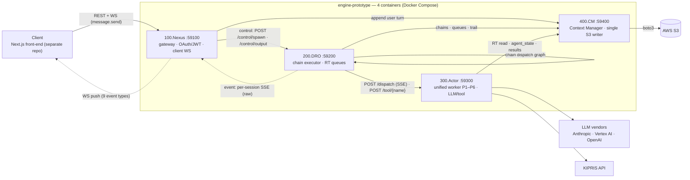

# Youdea — Patent AI Agent Engine (DRC)

> English version: [README.md](README.md)


**Youdea** 는 막연한 아이디어에서 특허 출원까지 발명자를 안내하는 multi-agent AI 플랫폼. 이 저장소는 그 백엔드 엔진 — 커스텀 tool-calling 오케스트레이션 (DRC), 4-컨테이너 FastAPI MSA, 실시간 WebSocket 스트리밍. Next.js front-end 는 별도 저장소.

<p align="center">
  
</p>

엔진은 **DRC (Distributed Reasoning Chain)** 아키텍처 기반: AI agent 의 사고 흐름을 외부 큐의 **RT (Reasoning Task)** 단위로 분해하고, 수동 워커 컨테이너가 RT 를 단위 호출로 수행하며, 모든 상태는 S3 에 영속화한다.

## Architecture

**4 Units / 4 Containers / 6 Personas**

### 시스템 다이어그램



모든 client 트래픽은 Nexus 로만 들어오고, 엔진 측 S3 쓰기는 전부 CM 을 거친다 (media 는 CM 발급 presigned URL 로 브라우저가 S3 직접 업로드). 실선 = 요청 경로, 점선 = 이벤트/push 스트림.

| Container | Port | 역할 |
| --- | --- | --- |
| `100.Nexus` | 59100 | **외부 게이트웨이 단독** — 모든 client REST + client WebSocket. federated OAuth (Google / Naver / Kakao, PKCE) + httpOnly 쿠키 세션, JWT 발급·검증 단독. account + work 생성/목록/진입/meta 소유, `ws_manager` / `event_mapper` / `ws_inbound` / `message_flow` / `event_consumer` / `dro_client` 보유. |
| `200.DRO` | 59200 (단일) | 순수 **내부** chain executor. 표면 = `POST /control/spawn` + `POST /control/output` (docx 빌드) + `GET /events/{user_id}/{work_id}` (SSE) + `GET /health` 만 — client REST/WS/media/auth 없음. |
| `400.CM` | 59400 | Context Manager — S3 단일 writer (76 endpoint: users / sessions / manifest / runtime / chains / models / drawings / outputs / media / admin). 부분 read/write 는 JSON Pointer (RFC 6901) / JSON Patch (RFC 6902) 표준화. |
| `300.Actor` | 59300 | unified 수동 워커 — 단일 컨테이너가 P1~P6 전 persona 수락 (수락 집합 = `@deployment/engine.config.yaml` `personas`). persona 별 동시성 cap 은 `src/slots.py` 가 집행 — 포화 시 503 + `Retry-After`, DRO 가 시간예산 안에서 backoff 재시도. |

> **표기**: 표의 이름 = container_name (`docker ps`). DNS 서비스키 = `nexus` / `dro` / `cm` / `actor`, 소스 디렉토리 = `100.Nexus` / `200.DRO` / `400.CM` / `300.Actor`.

유닛 간 내부 채널: **control** = Nexus→DRO REST (`POST /control/spawn` + `POST /control/output`), **event** = DRO→Nexus per-session SSE (chain 진행 원시 이벤트) — Nexus `event_mapper` 가 client WebSocket 이벤트로 변환.

자세한 설계: [`.docs/Architectures/DRC_ARCHITECTURE.md`](.docs/Architectures/DRC_ARCHITECTURE.md)

### Personas

단일 진실 원천 = [`@deployment/engine.config.yaml`](@deployment/engine.config.yaml) — Actor 코드는 persona 를 모른다 (범용 로더, 하드코딩 테이블 0).

| Persona | 이름 | 역할 | LLM (fallback) | Channel |
| --- | --- | --- | --- | --- |
| P1 | Buddy | 응대 — 대화·멀티모달 입력·발명 정보 누적 | Gemini 3.1 Pro Preview (→ Gemini 3 Flash Preview), Vertex AI | `support` |
| P2 | Director | 총괄 — 구체화 진단 (CDS/CMM/UR)·IOM 소유·작업 지휘 | Claude Opus 4.7 | `analysis` |
| P3 | Finder | 조사 — KIPRIS 선행기술 검색·커버리지 평가 | Gemini 3.1 Pro Preview (→ Gemini 3 Flash Preview) | `research` |
| P4 | Thinker | 추론 — 신규성/배타성 비교 분석·claim chart | GPT o3 | `thinking` |
| P5 | Crafter | 작성 — 도면 DL·명세 작성 | Claude Opus 4.7 | `drafting` |
| P6 | Inspector | 검토 — 산출물 검수·pass/fail 판정 | Gemini 3.1 Pro Preview (→ Gemini 3 Flash Preview) | `review` |

persona 정체는 client 에 노출하지 않는다 — 외부 표면은 channel 6 라벨만 본다.

### 데이터 흐름

1. 사용자 메시지가 WebSocket 으로 도착 (`message.send`, `correlation_id` 멱등).
2. Nexus 가 대화에 user turn 을 기록(CM 경유)하고 DRO 에 root chain 생성을 요청 — P01(응대)은 항상, P02(구체화)는 `engine=full` 일 때 함께.
3. DRO 가 chain 의 RT 들을 큐에 적재. (session, persona) 당 단일 worker 가 chain 단위로 순차 소비하며 RT 를 Actor 에 전달 (`POST /dispatch`, SSE). tool step 도 RT — DRO 가 Actor `POST /tool/{name}` 을 직접 호출 (LLM 없음).
4. Actor 가 그 RT 의 LLM SDK 호출(또는 tool)을 수행하고 결과를 CM 경유로 S3 에 영속화 (키 구조 SoT = `shared/venezia_memory/scaffolding.yaml`).
5. chain 마지막 step 이 후속 chain 을 지정 가능 (chain dispatch graph). Nexus 가 진행 원시 이벤트를 client WebSocket 이벤트로 변환.

`models/` 의 정량 모델: **IOM** (invention object model), **CDS** (concept discovery stack), **CMM** (concept maturity model), **UR** (user roadmap) — 현재 writer 는 P02.R00 chain (CDS/CMM/UR 갱신, IOM 은 P02.R99 활성화까지 read-only).

## 설계 이유 · 트레이드오프

엔진이 왜 이런 형태인지 — 각 결정이 사는 것과 치르는 비용 (출처: 아래 링크의 아키텍처 문서).

| 결정 | 왜 · 얻은 것 | 포기한 것 |
| --- | --- | --- |
| 사고를 외부 큐 RT 로 분해 (DRC) | AI 가 스스로 루프를 돌지 않음 — 모든 step 이 추적·재시도 가능, 끊긴 chain 은 재시작 시 자동 재개 (`resume_active_chains`) | RT 마다 상태 직렬화·왕복 비용 (멀티모달 첨부는 base64 로 동행) |
| 4-컨테이너 분리 | auth 는 Nexus 단독 — JWT 발급·검증 한 곳, DRO/Actor 는 internal-network trust; DRO 는 흐름만, Actor 는 순수 실행자, CM 은 데이터 평면 | — |
| CM 단일 S3 writer + key 별 lock | 모든 쓰기가 한 프로세스로 수렴 — key 별 read-modify-write 원자성 | CM 수평 확장 불가 (단일 인스턴스 전제); 크로스-key 트랜잭션 없음 |
| persona-agnostic unified Actor | persona 변경 = `engine.config.yaml` 1파일 수정 (코드에 persona 테이블 0); 격리는 persona 별 동시성 cap | — |
| chain dispatch graph | step 2종 + 정수 enum `dispatch_choice` 로 잘못된 분기가 표현 불가; chain 마다 독립 관측 | 중첩 sub-pipeline·SDK handoff 없음 — cross-persona 흐름은 그래프로만 |
| tool 도 RT | tool step 도 LLM step 과 같은 rt_id·기록·`rt_*` 이벤트 — 관측 모델 단일화 | — |
| (session, persona) 직렬 소비 | 연속 메시지가 동시 chain 을 띄워 공유 모델을 lost-update 하는 일 방지 (admission 코얼레싱) | 같은 (session, persona) 처리량 직렬화 — 병렬은 persona 간·session 간·chain 내 fan-out 만 |
| 이벤트는 best-effort (진실 = CM) | 전달 보장을 유지할 필요 없음 — client 는 REST refresh 로 복구 (`system.resync_required`) | 신뢰 전달 아님; replay buffer 가 못 채우면 client 재동기화 필요 |

출처: [`DRC_ARCHITECTURE.md`](.docs/Architectures/DRC_ARCHITECTURE.md) · [`AGENT_SDK_DESIGN.md`](.docs/Architectures/AGENT_SDK_DESIGN.md) · [`STATIC_BLOCK_ARCHITECTURE.md`](.docs/Architectures/STATIC_BLOCK_ARCHITECTURE.md) · [`.docs/Report/`](.docs/Report/)

## External API

client-facing REST + WebSocket 은 전부 Nexus — REST 32개 (트리: `info` / `user` / `works`) + WebSocket 1개 (+ `GET /health`).

- **인증**: federated OAuth `google` / `naver` / `kakao` (PKCE S256), httpOnly 쿠키 (`nx_access` 15분 / `nx_refresh` 14일·family 회전 / `nx_pkce`), 런타임 `AUTH_MODE = OPEN | SECURE` (`auth` knob `open` / `secure` 로 결정). `user_id` 는 자체 발급 UUID — JWT·provider sub 와 무관, PII 미저장.
- **WebSocket**: `WS /api/v1/works/{work_id}/thread/stream?since_seq=N` — envelope v2 `{type, timestamp, seq, data}`, (user, work) 키별 seq + replay buffer (200). inbound action = `message.send` 단일. server push 이벤트 9종: `message.received`, `message.reply`, `work.progress`, `work.failed`, `model.maturity`, `model.roadmap`, `output.ready`, `system.resync_required`, `system.error`.
- **명세**: [`EXTERNAL_API.md`](.docs/Architectures/EXTERNAL_API.md) · OpenAPI 스냅샷 [`openapi.nexus.json`](.docs/Architectures/external_api/openapi.nexus.json) · AsyncAPI [`asyncapi.yaml`](.docs/Architectures/external_api/asyncapi.yaml) · client 핸드오프 [`CLIENT-HANDOFF.md`](.docs/Architectures/external_api/CLIENT-HANDOFF.md) · WS event schema [`websocket-events.json`](@contracts/00.dro/websocket-events.json)
- **실행 중 OpenAPI** (client-facing 명세 = Nexus 단독): `http://localhost:59100/api/v1/openapi.json`

## Tech Stack

- **Framework**: FastAPI (Python 3.14+)
- **Orchestration**: 커스텀 tool-calling — DRC pipeline + Actor tool registry (`300.Actor/src/tools/`, 10 도메인 19 등록 tool) + `fetch_*` self-chain function calling (6종)
- **Package Manager**: uv (pip/poetry 대체)
- **Validation**: Pydantic v2
- **Storage**: AWS S3 — `400.CM` 가 단일 writer (boto3 직접), 키 구조 SoT = `shared/venezia_memory/scaffolding.yaml`
- **LLM SDK**: `claude-agent-sdk` (P2/P5) · `google-adk` + `google-genai` Vertex AI (P1/P3/P6, global endpoint) · `openai-agents` (P4)
- **외부 데이터**: KIPRIS (한국특허정보원 특허 API) — Actor wrapper tool `kipris.search_patents` / `kipris.get_patent_detail`, fake knob 은 canned fixture
- **Inter-container**: HTTP + SSE
- **Document**: python-docx (`200.DRO/src/docx_generator.py`, `POST /control/output` 배선: IOM → docx → CM upload → `output.ready`)
- **도면/도구 의존성**: plantuml / openscad / schemdraw / chromadb
- **공유 라이브러리**: `shared/` 의 `venezia_*` 9 패키지 (logging · secrets · contracts · topology · memory · pipeline_runtime · deployment · cm_client · media_config)
- **Secrets**: AWS Secrets Manager 단일 source — 컨테이너 시작 시 자동 fetch + env 주입 (`shared/venezia_secrets`)

## 배포 프로파일 (knobs)

`make deploy` 가 committed 스키마 [`@deployment/knobs.yaml`](@deployment/knobs.yaml) 로부터 `@deployment/profile.stack.yaml` (gitignored, 현재 값) 을 쓰고, 컨테이너는 `/etc/deployment.yaml` 마운트를 런타임 read (`venezia_deployment`).

| Knob | 값 (default) | 의미 |
| --- | --- | --- |
| `actor` / `dro` | `real` \| `fake` (`real`) | 컨테이너를 mock 이미지로 교체 — `dro:fake` = tape player (`tests/data/dro-tapes`), `actor:fake` = fixture replay + canned tool |
| `cm` / `nexus` | `real` (`fake` 미구현) | `fake` 선택 시 fail-loud |
| `llm` | `real` \| `fake` (`real`) | `real` = PRODUCTION (실 SDK 호출 — EC2 IAM role 환경 필수) · `fake` = FIXTURE replay |
| `kipris` | `real` \| `fake` (`real`) | `fake` = canned fixture, API 키 불요 |
| `auth` | `secure` \| `open` (`secure`) | `open` = 인증 불요 + 고정 user id (로컬 dev) |
| `engine` | `full` \| `smalltalk` (`full`) | 사용자 메시지마다 P01 과 함께 P02 도 spawn 할지 |

명령: `make deploy init [<knob> <value>…]` · `make deploy set <knob> <value>` · `show` / `vet` / `reset` · `make mode` (현재 모드 표시).

## Getting Started

### Prerequisites

- Docker & Docker Compose
- uv
- AWS credentials — PRODUCTION 모드(`llm real`)는 EC2 IAM role 환경에서만 동작. 모든 API 키는 AWS Secrets Manager 에서 옴

### 스택 실행

```bash
make deploy init llm fake auth open && make up   # 로컬 dev: 4 컨테이너 (FIXTURE + OPEN)
make deploy init && make up                      # 실 운영: 전 knob default (PRODUCTION + SECURE, EC2 IAM)

make mode                  # 현재 profile 모드
make logs                  # 전체 로그
make ps                    # 컨테이너 상태
make down                  # 종료 + image / volume 제거
```

`make up` 은 항상 풀 reset (캐싱 없음, ~5분): teardown → `--no-cache --pull` rebuild → recreate → healthcheck. **부분 반영 룰 없음** — 모든 코드 변경은 `make up` 으로만 반영.

## Pipelines

chain 정의는 [`@pipelines/`](@pipelines/) — `P{NN}.R{NN}.*.pipeline.json` 22개 (P01 1 · P02 8 · P03 6 · P04 4 · P05 2 · P06 1) + persona 별 `COMMON` + 공유 `GLOBAL.json`. step 은 단 2종 — LLM step (`instructions`, inline XOR markdown reference) 과 tool step (`tool`); **둘 다 RT**. 마지막 step 의 `dispatch_choice` 출력이 `dispatch_to` 로 후속 chain 을 선택 (self-recursion 은 가드 하에 허용). legacy 포맷은 fail-loud.

```bash
make play               # 無인자 = root pipeline 전수 (fixture 보유 *.R00.*)
make play P02.R00       # 단일 pipeline (dispatch 된 후속 chain 자동 추적)
make play P03.R00 SEED=path.json WS_TIMEOUT=1800
```

## 검증 — 7 track

```bash
make validate    # 정적: pipeline / contract / config — 15 stage
make lint        # ruff (--fix + format 자동적용) · mypy · bandit · pip-audit — 4개 다 게이트
make invoke      # 스택 없는 로직 테스트, 5 suite, 라인 커버리지 99% 게이트 (유일한 라인-커버리지 트랙)
make probe       # 실 CM 블랙박스, 13 sub-command (verify = 게이트: 전 API 전수 + S3 구조 대조)
make enact       # Actor 단일 RT 시나리오 5/5 게이트 + 단건 모드 (P{NN}.R{NN} <step> | SPEC= | PERSONA= PROMPT=)
make play        # pipeline 실행 (無인자 = root 전수, P{NN}.R{NN} = 단일)
make endpoint    # 외부 REST + WS contract e2e — 11 phase (+ 단건: `call REST="…"` / `call WS='…'`)
```

track 인벤토리: [`.docs/Verification/verification.md`](.docs/Verification/verification.md)

## 현황 · placeholder

- `output/proposal` endpoint 는 501. draft 다운로드의 결제 게이트 (`X-Payment-Token`) 는 placeholder.
- `P02.R99.CENTRAL_AGENT` (정식 7-way dispatch) 는 예정 target — 활성화 전까지 도면 chain graph (P04/P05/P06) 와 IOM write 경로는 미가동, 현행 P02.R00 chain 은 CDS/CMM/UR 만 갱신.
- 알려진 잔재는 [`.docs/Issues/`](.docs/Issues/) 에 기록 (8 문서).

## Documentation

- [`.docs/Architectures/STATIC_BLOCK_ARCHITECTURE.md`](.docs/Architectures/STATIC_BLOCK_ARCHITECTURE.md) — 설계 의도 원본 (수정 금지)
- [`.docs/Architectures/DRC_ARCHITECTURE.md`](.docs/Architectures/DRC_ARCHITECTURE.md) — 현행 단일 진실 원천
- [`.docs/Architectures/AGENT_SDK_DESIGN.md`](.docs/Architectures/AGENT_SDK_DESIGN.md) — Actor SDK 통합 (agent_state envelope)
- [`.docs/Architectures/DIRECTION_PIPELINE_FLOW.md`](.docs/Architectures/DIRECTION_PIPELINE_FLOW.md) — P02 Director 흐름
- [`.docs/Architectures/EXTERNAL_API.md`](.docs/Architectures/EXTERNAL_API.md) — 외부 REST + WS contract
- [`.docs/Features/CONCEPT_MATURITY_FLOW.md`](.docs/Features/CONCEPT_MATURITY_FLOW.md) — 구체화 단계 (P02.R00)
- [`.docs/Features/DRAWING_FLOW.md`](.docs/Features/DRAWING_FLOW.md) — 도면 chain graph
- [`.docs/Verification/verification.md`](.docs/Verification/verification.md) — 검증 7 track 인벤토리
- [`.docs/Issues/`](.docs/Issues/) — 알려진 잔재 · [`.docs/Report/`](.docs/Report/) — 조사·결정 기록
- [`.claude/rules/onboarding.instructions.md`](.claude/rules/onboarding.instructions.md) — 신규 합류자 절차
- [`.claude/rules/project.instructions.md`](.claude/rules/project.instructions.md) — 아키텍처·원칙·기술스택 전체
- [`.claude/rules/standard.instructions.md`](.claude/rules/standard.instructions.md) — 코딩·작업 규칙
