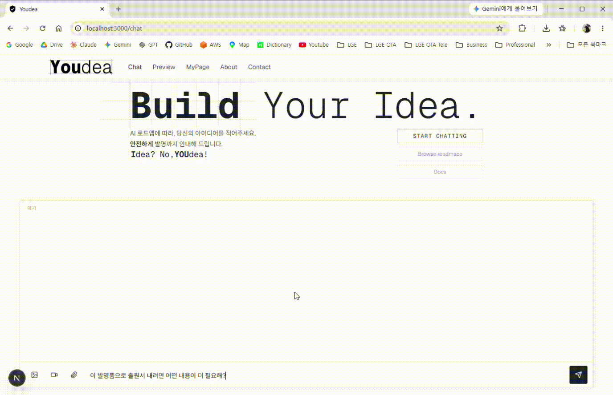
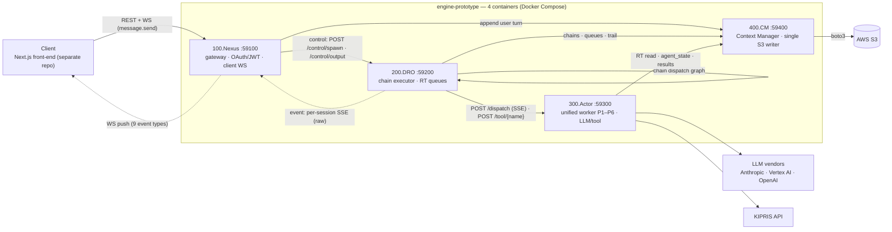

# Youdea — Patent AI Agent Engine (DRC)

> 한국어 문서: [README.ko.md](README.ko.md)


**Youdea** is a multi-agent AI platform that takes inventors from a rough idea to a patent application. This repository is the backend engine — custom tool-calling orchestration (DRC), a 4-container FastAPI microservice stack, and real-time WebSocket streaming; the Next.js front-end lives in a separate repository.

<p align="center">
  
</p>

The engine is built on the **Distributed Reasoning Chain (DRC)** architecture: an agent's reasoning flow is decomposed into externally queued **Reasoning Tasks (RTs)**, a passive worker container executes them one unit at a time, and all state is persisted to S3.

Public snapshot of a privately developed project. This repo contains the agent engine and backend services; the frontend (Next.js) is kept private. Source available for portfolio/reference purposes; all rights reserved.

## Architecture

**4 Units / 4 Containers / 6 Personas**

### System diagram



All client traffic enters through Nexus; every engine-side write to S3 goes through CM (media uploads go browser→S3 directly via CM-issued presigned URLs). Solid arrows = request paths, dashed = event/push streams.

| Container   | Port           | Role                                                                                                                                                                                                                                                                                                                                  |
| ----------- | -------------- | ------------------------------------------------------------------------------------------------------------------------------------------------------------------------------------------------------------------------------------------------------------------------------------------------------------------------------------- |
| `100.Nexus` | 59100          | **Sole external gateway** — all client REST + client WebSocket. Federated OAuth (Google / Naver / Kakao, PKCE) with httpOnly cookie sessions; JWT is issued and verified here only. Owns account + work create/list/entry/meta, plus `ws_manager` / `event_mapper` / `ws_inbound` / `message_flow` / `event_consumer` / `dro_client`. |
| `200.DRO`   | 59200 (single) | Pure **internal** chain executor. Surface = `POST /control/spawn` + `POST /control/output` (docx build) + `GET /events/{user_id}/{work_id}` (SSE) + `GET /health` only — no client REST/WS/media/auth.                                                                                                                                |
| `400.CM`    | 59400          | Context Manager — the single S3 writer (76 endpoints: users / sessions / manifest / runtime / chains / models / drawings / outputs / media / admin). Partial reads and writes are standardized on JSON Pointer (RFC 6901) / JSON Patch (RFC 6902).                                                                                    |
| `300.Actor` | 59300          | Unified passive worker — one container accepts every persona P1–P6 (accept set = `@deployment/engine.config.yaml` `personas`). Per-persona concurrency caps are enforced in `src/slots.py`; saturation returns 503 + `Retry-After`, which DRO retries with backoff inside a time budget.                                              |

> Naming: table names = `container_name` (`docker ps`). DNS service keys = `nexus` / `dro` / `cm` / `actor`; source directories = `100.Nexus` / `200.DRO` / `400.CM` / `300.Actor`.

Internal channels between the units: **control** = Nexus→DRO REST (`POST /control/spawn` + `POST /control/output`), **event** = DRO→Nexus per-session SSE of raw chain events, which Nexus `event_mapper` translates into client WebSocket events.

Full design: [`.docs/Architectures/DRC_ARCHITECTURE.md`](.docs/Architectures/DRC_ARCHITECTURE.md)

### Personas

Single source of truth = [`@deployment/engine.config.yaml`](@deployment/engine.config.yaml) — Actor code is persona-agnostic (generic loader, zero hardcoded persona tables).

| Persona | Name      | Role                                                                               | LLM (fallback)                                               | Channel    |
| ------- | --------- | ---------------------------------------------------------------------------------- | ------------------------------------------------------------ | ---------- |
| P1      | Buddy     | Reception — conversation, multimodal input, invention capture                      | Gemini 3.1 Pro Preview (→ Gemini 3 Flash Preview), Vertex AI | `support`  |
| P2      | Director  | Orchestration — concept-maturity diagnosis (CDS/CMM/UR), IOM owner, work direction | Claude Opus 4.7                                              | `analysis` |
| P3      | Finder    | Research — KIPRIS prior-art search, coverage evaluation                            | Gemini 3.1 Pro Preview (→ Gemini 3 Flash Preview)            | `research` |
| P4      | Thinker   | Reasoning — novelty/exclusivity analysis, claim charts                             | GPT o3                                                       | `thinking` |
| P5      | Crafter   | Drafting — drawings (DL) and specification                                         | Claude Opus 4.7                                              | `drafting` |
| P6      | Inspector | Review — deliverable inspection, pass/fail                                         | Gemini 3.1 Pro Preview (→ Gemini 3 Flash Preview)            | `review`   |

Persona identity is never exposed to clients — external surfaces only show the six channel labels.

### Data flow

1. A user message arrives over the WebSocket (`message.send`, idempotent by `correlation_id`).
2. Nexus appends the user turn to the conversation (via CM) and asks DRO to spawn root chains — always P01 (reply), plus P02 (concept maturity) when `engine=full`.
3. DRO enqueues the chain's RTs; a single worker per (session, persona) consumes chains one at a time, dispatching each RT to Actor (`POST /dispatch`, SSE). Tool steps are RTs too — DRO calls Actor `POST /tool/{name}` directly, no LLM.
4. Actor runs the LLM SDK call (or tool) for that RT and persists results through CM to S3 (key layout SoT = `shared/venezia_memory/scaffolding.yaml`).
5. A chain's last step can dispatch follow-up chains (chain dispatch graph); Nexus maps raw progress into client WebSocket events.

Quantitative models maintained under `models/`: **IOM** (invention object model), **CDS** (concept discovery stack), **CMM** (concept maturity model), **UR** (user roadmap) — currently written by the P02.R00 chain (CDS/CMM/UR; IOM is read-only until P02.R99 activates).

## Design rationale & trade-offs

Why the engine is shaped this way — each decision with what it buys and what it costs (sources: the architecture documents linked below).

| Decision                                              | Why / gained                                                                                                                                                            | Traded away                                                                                                                 |
| ----------------------------------------------------- | ----------------------------------------------------------------------------------------------------------------------------------------------------------------------- | --------------------------------------------------------------------------------------------------------------------------- |
| Reasoning decomposed into externally queued RTs (DRC) | The agent never loops on its own — every step is trackable and retryable, and interrupted chains auto-resume after a restart (`resume_active_chains`)                   | State serialization and a round-trip per RT (multimodal attachments ride along as base64)                                   |
| 4-container split                                     | Auth only in Nexus — JWT issued and verified in one place, DRO/Actor run on internal-network trust; DRO knows only flow, Actor is a pure executor, CM is the data plane | —                                                                                                                           |
| CM as the single S3 writer + per-key lock             | Every write funnels through one process — per-key read-modify-write atomicity                                                                                           | CM cannot scale horizontally (single-instance assumption); no cross-key transactions                                        |
| Persona-agnostic unified Actor                        | Changing a persona = editing `engine.config.yaml` only (zero persona tables in code); isolation via per-persona concurrency caps                                        | —                                                                                                                           |
| Chain dispatch graph                                  | Two step kinds + an integer-enum `dispatch_choice` make invalid branches unrepresentable; each chain stays independently observable                                     | No nested sub-pipelines or SDK handoffs — cross-persona flow only through the graph                                         |
| Tools are RTs too                                     | Tool steps get the same rt*id, records, and `rt*\*` events as LLM steps — one observation model                                                                         | —                                                                                                                           |
| Serial chain consumption per (session, persona)       | Back-to-back messages can't spawn concurrent chains that lose updates to shared models (admission coalescing)                                                           | Throughput within one (session, persona) is serialized — parallelism only across personas/sessions and via in-chain fan-out |
| Events are best-effort (CM is the truth)              | No delivery guarantees to maintain — clients recover via REST refresh (`system.resync_required`)                                                                        | Not reliable delivery; clients must resync when the replay buffer can't serve them                                          |

Sources: [`DRC_ARCHITECTURE.md`](.docs/Architectures/DRC_ARCHITECTURE.md) · [`AGENT_SDK_DESIGN.md`](.docs/Architectures/AGENT_SDK_DESIGN.md) · [`STATIC_BLOCK_ARCHITECTURE.md`](.docs/Architectures/STATIC_BLOCK_ARCHITECTURE.md) · [`.docs/Report/`](.docs/Report/)

## External API

All client-facing REST + WebSocket is served by Nexus — 32 REST routes (tree: `info` / `user` / `works`) + 1 WebSocket (+ `GET /health`).

- **Auth**: federated OAuth `google` / `naver` / `kakao` (PKCE S256), httpOnly cookies (`nx_access` 15 min / `nx_refresh` 14 days with family rotation / `nx_pkce`), runtime `AUTH_MODE = OPEN | SECURE` (selected by the `auth` knob `open` / `secure`). `user_id` is an internally minted UUID — independent of the JWT and of provider subjects; no PII is stored.
- **WebSocket**: `WS /api/v1/works/{work_id}/thread/stream?since_seq=N` — envelope v2 `{type, timestamp, seq, data}`, per-(user, work) seq + replay buffer (200). Inbound action = `message.send` only. Server push = 9 event types: `message.received`, `message.reply`, `work.progress`, `work.failed`, `model.maturity`, `model.roadmap`, `output.ready`, `system.resync_required`, `system.error`.
- **Specs**: [`EXTERNAL_API.md`](.docs/Architectures/EXTERNAL_API.md) · OpenAPI snapshot [`openapi.nexus.json`](.docs/Architectures/external_api/openapi.nexus.json) · AsyncAPI [`asyncapi.yaml`](.docs/Architectures/external_api/asyncapi.yaml) · client handoff notes [`CLIENT-HANDOFF.md`](.docs/Architectures/external_api/CLIENT-HANDOFF.md) · WS event schema [`websocket-events.json`](@contracts/00.dro/websocket-events.json)
- **Live OpenAPI** (client-facing spec is Nexus-only): `http://localhost:59100/api/v1/openapi.json`

## Tech Stack

- **Framework**: FastAPI (Python 3.14+)
- **Orchestration**: custom tool-calling — DRC pipelines + Actor tool registry (`300.Actor/src/tools/`, 19 registered tools in 10 domains) + `fetch_*` self-chain function calling (6 tools)
- **Package Manager**: uv (replaces pip/poetry)
- **Validation**: Pydantic v2
- **Storage**: AWS S3 — `400.CM` is the single writer (boto3 direct); key layout SoT = `shared/venezia_memory/scaffolding.yaml`
- **LLM SDKs**: `claude-agent-sdk` (P2/P5) · `google-adk` + `google-genai` on Vertex AI (P1/P3/P6, global endpoint) · `openai-agents` (P4)
- **External data**: KIPRIS (Korean patent information API) — Actor wrapper tools `kipris.search_patents` / `kipris.get_patent_detail`, fake knob with canned fixtures
- **Inter-container**: HTTP + SSE
- **Document**: python-docx (`200.DRO/src/docx_generator.py`, wired at `POST /control/output`: IOM → docx → CM upload → `output.ready`)
- **Drawing/tool deps**: plantuml / openscad / schemdraw / chromadb
- **Shared libraries**: 9 `venezia_*` packages under `shared/` (logging · secrets · contracts · topology · memory · pipeline_runtime · deployment · cm_client · media_config)
- **Secrets**: AWS Secrets Manager as the single source — fetched and injected into env automatically at container start (`shared/venezia_secrets`)

## Deployment profile (knobs)

`make deploy` writes `@deployment/profile.stack.yaml` (gitignored, current values) from the committed schema [`@deployment/knobs.yaml`](@deployment/knobs.yaml); containers read it at runtime via `/etc/deployment.yaml` (`venezia_deployment`).

| Knob            | Values (default)                | Meaning                                                                                                                                 |
| --------------- | ------------------------------- | --------------------------------------------------------------------------------------------------------------------------------------- |
| `actor` / `dro` | `real` \| `fake` (`real`)       | Swap the container for its mock image — `dro:fake` = tape player (`tests/data/dro-tapes`), `actor:fake` = fixture replay + canned tools |
| `cm` / `nexus`  | `real` (`fake` not implemented) | Selecting `fake` fails loudly                                                                                                           |
| `llm`           | `real` \| `fake` (`real`)       | `real` = PRODUCTION (live SDK calls — EC2 IAM role environment required) · `fake` = FIXTURE replay                                      |
| `kipris`        | `real` \| `fake` (`real`)       | `fake` = canned fixtures, no API key needed                                                                                             |
| `auth`          | `secure` \| `open` (`secure`)   | `open` = no auth, fixed user id (local dev)                                                                                             |
| `engine`        | `full` \| `smalltalk` (`full`)  | Whether each user message also spawns P02 alongside P01                                                                                 |

Commands: `make deploy init [<knob> <value>…]` · `make deploy set <knob> <value>` · `show` / `vet` / `reset` · `make mode` (print current modes).

## Getting Started

### Prerequisites

- Docker & Docker Compose
- uv
- AWS credentials — PRODUCTION mode (`llm real`) runs only in an EC2 IAM role environment; all API keys come from AWS Secrets Manager

### Running the stack

```bash
make deploy init llm fake auth open && make up   # local dev: 4 containers (FIXTURE + OPEN)
make deploy init && make up                      # production: all-knob defaults (PRODUCTION + SECURE, EC2 IAM)

make mode                  # current profile modes
make logs                  # tail all logs
make ps                    # container status
make down                  # stop + remove images/volumes
```

`make up` is always a full reset (no caching, ~5 min): teardown → `--no-cache --pull` rebuild → recreate → healthcheck. There is no partial-apply path — every code change ships through `make up`.

## Pipelines

Chains live in [`@pipelines/`](@pipelines/) — 22 `P{NN}.R{NN}.*.pipeline.json` files (P01 1 · P02 8 · P03 6 · P04 4 · P05 2 · P06 1) + per-persona `COMMON` + shared `GLOBAL.json`. Exactly two step kinds — LLM step (`instructions`, inline XOR markdown reference) and tool step (`tool`); **both are RTs**. The last step's `dispatch_choice` output selects follow-up chains via `dispatch_to` (self-recursion allowed with a guard); legacy formats fail loudly.

```bash
make play               # no args = every root pipeline (fixture-backed *.R00.*)
make play P02.R00       # single pipeline (dispatched follow-up chains are followed automatically)
make play P03.R00 SEED=path.json WS_TIMEOUT=1800
```

## Verification — 7 tracks

```bash
make validate    # static: pipelines / contracts / config — 15 stages
make lint        # ruff (--fix + format applied) · mypy · bandit · pip-audit — all four gate
make invoke      # stackless logic tests, 5 suites, 99% line-coverage gate (the only line-coverage track)
make probe       # real-CM black box, 13 sub-commands (verify = gate: full API sweep + S3 structure diff)
make enact       # Actor single-RT scenarios, 5/5 gate + one-shot mode (P{NN}.R{NN} <step> | SPEC= | PERSONA= PROMPT=)
make play        # pipeline runs (no args = all roots, P{NN}.R{NN} = single)
make endpoint    # external REST + WS contract e2e — 11 phases (+ one-shot: `call REST="…"` / `call WS='…'`)
```

Track inventory: [`.docs/Verification/verification.md`](.docs/Verification/verification.md)

## Status & placeholders

- `output/proposal` endpoints return 501; the draft-download payment gate (`X-Payment-Token`) is a placeholder.
- `P02.R99.CENTRAL_AGENT` (the full 7-way dispatch) is a planned target, not yet active — until it activates, the drawing chain graph (P04/P05/P06) and the IOM write path stay dormant; the current P02.R00 chain updates CDS/CMM/UR only.
- Known residuals are tracked in [`.docs/Issues/`](.docs/Issues/) (8 documents).

## Documentation

- [`.docs/Architectures/STATIC_BLOCK_ARCHITECTURE.md`](.docs/Architectures/STATIC_BLOCK_ARCHITECTURE.md) — original design intent (do not edit)
- [`.docs/Architectures/DRC_ARCHITECTURE.md`](.docs/Architectures/DRC_ARCHITECTURE.md) — current single source of truth
- [`.docs/Architectures/AGENT_SDK_DESIGN.md`](.docs/Architectures/AGENT_SDK_DESIGN.md) — Actor SDK integration (agent_state envelope)
- [`.docs/Architectures/DIRECTION_PIPELINE_FLOW.md`](.docs/Architectures/DIRECTION_PIPELINE_FLOW.md) — P02 Director flow
- [`.docs/Architectures/EXTERNAL_API.md`](.docs/Architectures/EXTERNAL_API.md) — external REST + WS contract
- [`.docs/Features/CONCEPT_MATURITY_FLOW.md`](.docs/Features/CONCEPT_MATURITY_FLOW.md) — concept-maturity stage (P02.R00)
- [`.docs/Features/DRAWING_FLOW.md`](.docs/Features/DRAWING_FLOW.md) — drawing chain graph
- [`.docs/Verification/verification.md`](.docs/Verification/verification.md) — 7-track verification inventory
- [`.docs/Issues/`](.docs/Issues/) — known residuals · [`.docs/Report/`](.docs/Report/) — investigation/decision records
- [`.claude/rules/onboarding.instructions.md`](.claude/rules/onboarding.instructions.md) — onboarding walkthrough
- [`.claude/rules/project.instructions.md`](.claude/rules/project.instructions.md) — architecture, principles, tech stack
- [`.claude/rules/standard.instructions.md`](.claude/rules/standard.instructions.md) — coding & workflow rules
